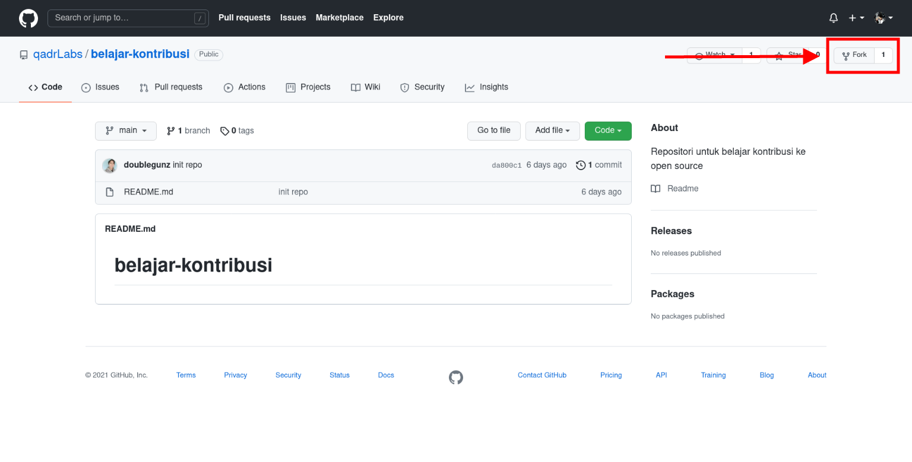
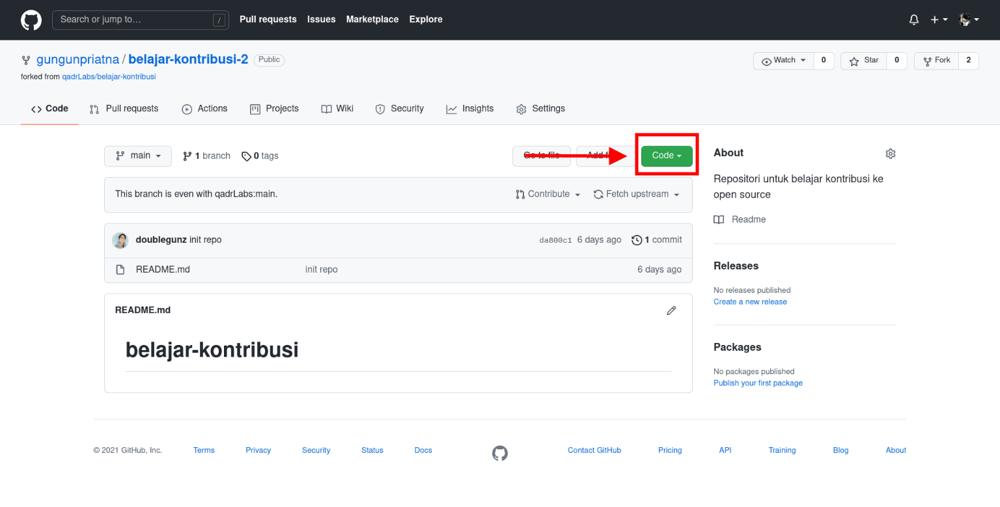
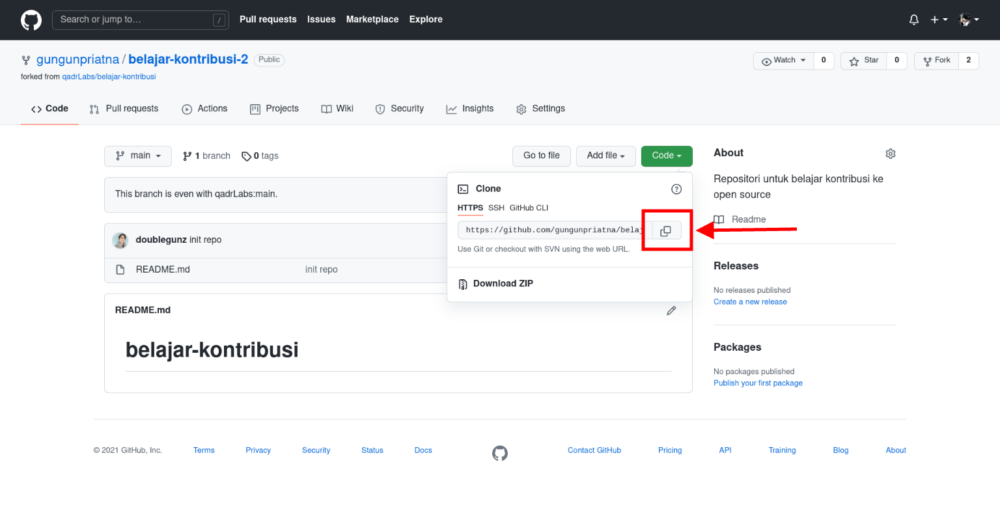
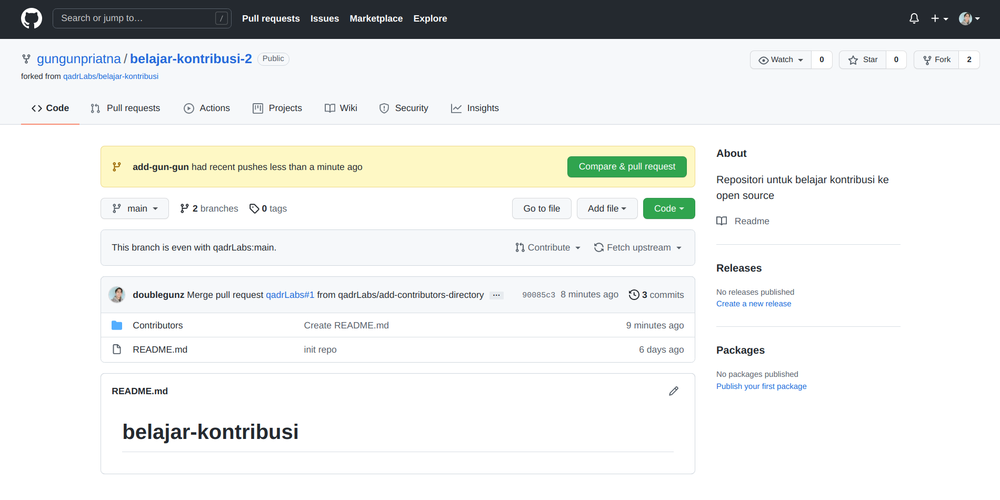
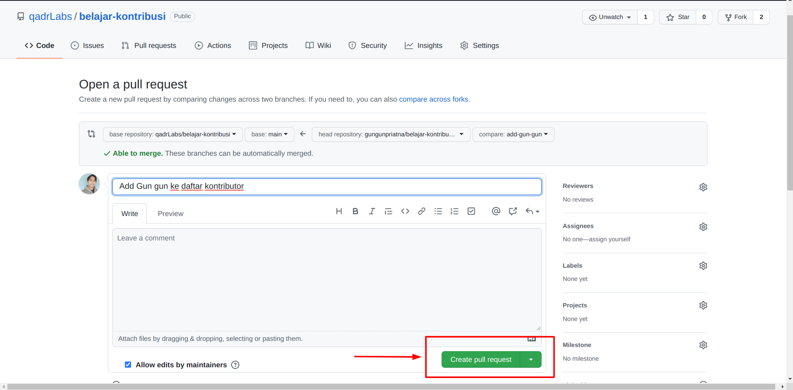

[](https://github.com/ellerbrock/open-source-badges/)
[](https://opensource.org/licenses/MIT)

# Belajar Kontribusi
Repositori untuk belajar kontribusi open source project.

## Fork Repositori
Fork repositori ini dengan cara menekan tombol fork di sebelah kan atas. 



## Clone repositori hasil fork
Selanjutnya, clone repo hasil fork yang ada di akun kamu ke komputer local. Tekan tombol Code, lalu tekan icon *copy to clipboard* .





Buka terminal lalu run git command di bawah ini:
```
git clone "url yang udah dicopy"
```


Misalnya:
```
git clone https://github.com/username-kamu/belajar-kontribusi.git
```
di mana `username-kamu` diisi sama username akun GitHub kamu.

## Buat branch baru
Setelah repositori di-clone, buka folder repositori:

```
cd belajar-kontribusi
```
Lalu buat branch baru menggunakan command `git checkout`:
```
git checkout -b <add-nama-kamu>
```

Contohnya:
```
git checkout -b add-gun-gun
```
(Nama branch-nya bebas. Cuma mesti disesuaikan sama tujuan branch dibuat ya.)

## Modifikasi dan Commit
Buat file baru di dalam folder `Contributors` dengan format `nama-kamu.md` contohnya (`gun-gun-priatna.md`). Tentang markdown bisa kamu baca-baca cheatsheet-nya [di sini yaa.](https://github.com/adam-p/markdown-here/wiki/Markdown-Cheatsheet).

Buka file `nama-kamu.md`, tuliskan nama dan deskripsi.

```
Name: [nama-kamu](url-akun-github) 
About: [Deskripsi tentang kamu]
```

Contoh:
```
Name: [Gun Gun Priatna](https://github.com/gungunpriatna) 
About: Saya seorang web developer
```

**Note:** Kamu boleh menuliskan asal untuk nama dan deskripsinya ya, karena ini tujuannya untuk belajar, bukan untuk mengumpulkan data.

Run command `git status` buat lihat modifikasi apa saja yang udah kamu lakukan. 

Selanjutnya tambahkan dengan menggunakan command `git add`:

```
git add Contributors/nama-kamu.md
```

Lalu commit:

```
git commit -m "Add <nama-kamu> ke daftar kontributor"
```

Ubah <nama-kamu> sama nama kamu ya.

## Push ke GitHub
Push dengan command `git push`:
```
git push origin <add-nama-kamu>
```
ubah `<add-nama-kamu>` dengan nama branch yang udah dibuat.

## Pull Request
Kalau kamu buka repositori kamu di GitHub, kamu bisa lihat tombol `Compare & pull request` button.  Tekan tombol tersebut.



Nah selanjutnya tekan tombol Create pull request.




Berikut adalah tambahan section untuk petunjuk **Sync Fork**:

---

## Sinkronisasi Fork

Jika repositori asli mengalami perubahan setelah kamu melakukan fork, kamu bisa menyinkronkan fork kamu dengan langkah-langkah berikut:

### 1. Tambahkan remote upstream
Pastikan kamu menambahkan repositori asli sebagai `upstream` di fork kamu. Jalankan perintah berikut di terminal:

```
git remote add upstream https://github.com/qadrLabs/belajar-kontribusi.git
```

Perintah ini akan menambahkan repositori asli sebagai referensi `upstream`, yang memungkinkan kamu untuk menarik perubahan dari sana.

### 2. Cek remote yang sudah ditambahkan
Untuk memastikan bahwa remote `upstream` sudah ditambahkan dengan benar, gunakan perintah berikut:

```
git remote -v
```

Perintah ini akan menampilkan daftar semua remote yang terhubung ke fork kamu, baik `origin` (fork kamu) maupun `upstream` (repositori asli).

### 3. Tarik perubahan dari upstream
Untuk menarik perubahan terbaru dari repositori asli (upstream), jalankan perintah berikut:

```
git fetch upstream
```

Perintah ini akan mengambil (fetch) semua perubahan dari repositori asli tanpa menggabungkannya ke dalam fork kamu.

### 4. Gabungkan perubahan dari upstream ke branch lokal
Setelah menarik perubahan, kamu bisa menggabungkannya ke branch `main` lokal kamu:

```
git merge upstream/main
```

Ini akan menggabungkan semua perubahan dari branch `main` di upstream ke branch `main` lokal kamu.

### 5. Push ke Fork kamu
Terakhir, setelah branch lokal kamu diperbarui, kamu bisa mendorong perubahan ini ke fork kamu di GitHub dengan perintah berikut:

```
git push origin main
```

Setelah melakukan ini, fork kamu sudah sinkron dengan repositori asli.

---

Dengan mengikuti langkah-langkah di atas, kamu bisa menjaga fork kamu tetap diperbarui dengan repositori asli, sehingga memudahkan untuk berkontribusi ke project open-source!